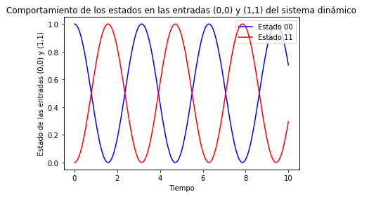

# Tutorial

Asumamos que queremos estudiar la evolución temporal de un estado $\mathbf{y}(t)$. Este estado será representado mediante una matriz 2x2 que corresponde a algún operador lineal. La función que genera la dinámica del problema es 
$$
f(t, \mathbf{y}) = -{\rm{i}} [\mathbf{O}, \mathbf{y}(t)],
$$
donde $\mathbf{O}$ es otro operador lineal, ${\rm{i}}$ es la constante compleja y $[A, B] = AB - BA$ es un operación de conmutación. Note que **la función $f(t, \mathbf{y})$ no depende explícitamente de la variable temporal**.

La constante compleja se denota en `Python` de la siguiente manera:
``` py
iConst = 1.0j
```

La dinámica del problema depende intrínsicamente del operador 𝐎. Escojamos el siguiente operador:
``` py
import numpy as np

oOper = np.array([[0, 1], [1, 0]])
```

Dicho operador puede tener distintos significados físicos dependiendo del problema dinámico en cuestión. Puede representar un mapa algebraico, el generador dinámico de un sistema caótico, un Hamiltoniano, etc. 

Lo siguiente es difinir un estado inicial. De igual forma, dicho estado puede representar cantidades físicas de un sistema. Consideremos:

``` py 
yInit = np.array([[1, 0], [0, 0]])
```

Note que el operador $\mathbf{O}$ no es diagonal, por lo cual esperamos que conforme avanza el tiempo, dicho operador modifica el estado $\mathbf{y}(t)$.

Implementemos la función $f(t, \mathbf{y})$ en `Python`. Para esto puede utilizar la función np.dot:

``` py
def dyn_generator(oper, state):
    return -1.0j * (np.dot(oper, state) - np.dot(state, oper))
```

Ahora tenemos que implementar la función que realiza la operación dinámica en `Python`, el método RK4:

``` py
def rk4(func, oper, state, h):
    k_1 = func(oper, state)
    k_2 = func(oper, state+k_1/2)
    k_3 = func(oper, state+k_2/2)
    k_4 = func(oper, state+k_3)
    return state + 1/6 * h * (k_1 + 2*k_2 + 2*k_3 + k_4)
```

(Puede ver la documentación de estas funciones en el aparatado de [referencias](reference.md))


Con estas funciones a nuestra disposición, podemos evaluar la dinámica temporal en una grilla temporal unidimensional. Para ello, se utiliza la función np.linspace para generar un arreglo con valores temporales. Se emplea un valor final de tiempo en 10.0 s y la separación homogénea entre los elementos del arreglo puede variar según el valor que se le asigne a num.
``` py 
times = np.linspace(0.0, 10.0, num=500)

h = times[1] - times[0]
# h = 1/(num -1) 
```

Dependiendo del valor que se le asigne a `num`, el elemento **h** del método RK4 va a tener diferentes valores.

Y, finalmente, llamamos de manera iterativa la rutina `rk4()`, calculando el operador del estado del sistema $\mathbf{y}(t)$ a través del tiempo. A través del tiempo, vamos a guardar la entrada $(0, 0)$ y $(1, 1)$ de la matriz $\mathbf{y}(t)$. 

Para esto, vamos a inicializar dos arreglos que van a contener los valores con valores iniciales cero. Utilizamos el mismo tamaño del arreglo que contiene la variable independiente temporal: 

``` py
stateQuant00 = np.zeros(times.size)
stateQuant11 = np.zeros(times.size)
```

Rutina principal: esta rutina realiza la evolución temporal.
 
``` py
for tt in range(times.size):
    # Se guarda el valor de las entradas (0,0) y (1,1) en los arreglos que se definieron.
    stateQuant00[tt] = yInit[0,0].real
    stateQuant11[tt] = yInit[1,1].real

    # Se invoca rk4 operando sobre yInit
    # Se devuelve el resultado a un nuevo yN
    yN = rk4(dyn_generator, oOper, yInit, h)

    # Ahora se asigna yN a yInit
    # De esta manera, en la siguiente iteración, el operador de esta iteración se convierte en el inicial
    # de la siguiente iteración
    yInit = yN
```

## Gráfico de los resultados

 


